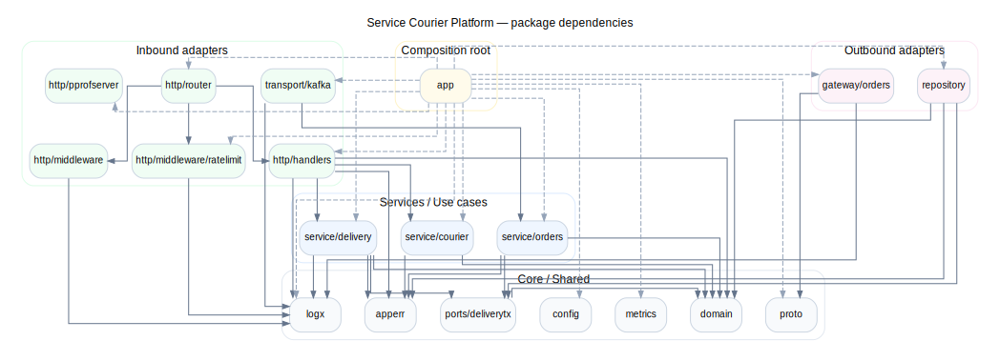

# Service Courier Platform (Go)

## Backend-сервис для управления курьерами и доставками, разделённый на два процесса:

- **`service-courier`** — HTTP API
- **`service-courier-worker`** — фоновый обработчик событий заказов (Kafka consumer)

Проект ориентирован на:

- **архитектуру** (слои, разделение ответственности, DI/composition root),
- **эксплуатацию** (метрики, профилирование, Docker Compose, миграции),
- **надёжность** (retry gateway, rate limiting, middleware, timeouts),
- **тестируемость** (unit/integration tests, CI).


## Что умеет проект

### HTTP API (chi router)
Доступные эндпоинты:

- `GET /ping` — liveness/ping
- `GET /metrics` — Prometheus metrics
- `HEAD /healthcheck` — lightweight healthcheck endpoint
- API домена:
  - `GET /courier/{id}`
  - `GET /couriers`
  - `POST /courier`
  - `PUT /courier`
  - `POST /delivery/assign`
  - `POST /delivery/unassign`

### Фоновая обработка (worker)
Отдельный процесс `service-courier-worker`:

- читает события заказов из Kafka,
- вызывает бизнес-логику обработки,
- работает с PostgreSQL и внешним сервисом заказов (orders gateway),
- запускается независимо от HTTP API (отдельный сервис в Docker Compose).

---

## Архитектура

Проект организован как **слоистая архитектура с явными границами модулей** (layered architecture).

### Dependency Injection / Composition Root (uber/dig)

В `internal/app` проект собирается через **`go.uber.org/dig`** (DI-контейнер).
Используется `ContainerBuilder`, который регистрирует зависимости по модулям:

- `registerCore`
- `registerDb`
- `registerDomainServices`
- `registerHTTP`
- `registerWorker`

Также проект собирает **разные графы зависимостей** для:
- HTTP API container (`MustBuild`)
- background worker container (`MustBuildWorker`)

Это упрощает:
- разделение ответственности между процессами,
- тестирование (подмена функции подключения к БД / функции аварийного логирования (fatal)),
- управление жизненным циклом зависимостей (servers, DB, внешние клиенты),
- расширение инфраструктурных зависимостей.

### Слои и модули

- `internal/domain` — доменные сущности (`courier`, `delivery`, `status`)
- `internal/service/*` — use cases / бизнес-логика
- `internal/repository` — работа с PostgreSQL
- `internal/http/*` — handlers, DTO, middleware, router, pprof server
- `internal/transport/kafka` — Kafka consumer
- `internal/gateway/orders` — интеграция с внешним orders-сервисом + retry wrapper
- `internal/app` — composition root / контейнер зависимостей / runners
- `internal/config` — загрузка конфигурации (`.env` -> env -> flags)
- `internal/metrics`, `internal/logx` — observability primitives

---

## Dependency graph



> Граф зависимостей сгенерирован из `deps.dot` (Graphviz).

## Технологический стек

- **Go 1.24**
- **chi** (HTTP router)
- **PostgreSQL** + **pgx**
- **Kafka** (Sarama)
- **Prometheus** / **Grafana**
- **pprof**
- **Docker / Docker Compose**
- **goose** (migrations)
- **GitHub Actions CI**
- **golangci-lint**
- **gRPC / protobuf** (в проекте есть `internal/proto`, gateway к orders-сервису)


## HTTP middleware и поведение роутера

HTTP router использует следующие middleware:

- `RequestID`
- `RealIP`
- `Observability(...)` (кастомное middleware для метрик/инструментирования)
- `Recoverer`
- `Timeout(5s)`

Важно:
- **rate limiting** применяется только к группе бизнес-эндпоинтов (`/courier`, `/delivery/...`)
- служебные эндпоинты (`/ping`, `/metrics`, `/healthcheck`) остаются без rate limiting (что удобно для мониторинга и health probes)

---

## Конфигурация

`internal/config` формирует конфигурацию в следующем порядке приоритета:

1. `.env` (если есть)
2. переменные окружения
3. CLI flags (например, `--port`, через `pflag`)

### Основные блоки конфига
- `Port`
- `DB` (host/port/user/pass/name)
- `Delivery` (например, `AutoReleaseInterval`)
- `OrdersGateway` (retry policy: `MaxAttempts`, `BaseDelay`, `MaxDelay`)
- `Kafka` (`Brokers`, `Topic`, `GroupID`)
- `Pprof` (`Enabled`, `Addr`, `User`, `Pass`)
- `RateLimit` (`Enabled`, `Rate`, `Burst`, `TTL`, `MaxBuckets`)

### Пример важных переменных окружения
- `PORT`
- `POSTGRES_HOST`, `POSTGRES_PORT`, `POSTGRES_USER`, `POSTGRES_DB`
- `POSTGRES_PASSWORD` **или** `POSTGRES_PASSWORD_FILE`
- `ORDER_SERVICE_HOST`
- `KAFKA_BROKERS`, `KAFKA_ORDER_TOPIC`, `KAFKA_GROUP_ID`
- `PPROF_ENABLED`, `PPROF_ADDR`, `PPROF_USER`, `PPROF_PASS`
- `RATE_LIMIT_ENABLED`, `RATE_LIMIT_RATE`, `RATE_LIMIT_BURST`, `RATE_LIMIT_TTL`, `RATE_LIMIT_MAX_BUCKETS`


## Локальный запуск (Docker Compose)

Проект подготовлен для локального запуска через Docker Compose и включает сервисы:

- `postgres`
- `migrate` (goose)
- `service-courier`
- `service-courier-worker`
- `prometheus`
- `grafana`

### Важный нюанс

В `docker-compose.yml` используется внешняя сеть:

- `infrastructure_default` (`external: true`)

Если сети ещё нет, создайте её заранее:

```bash
docker network create infrastructure_default
```

### Шаги запуска

```bash
cp .env.example .env
# при необходимости отредактируйте
```

```bash
docker compose up -d
```

Docker Compose поднимет инфраструктуру и запустит сервисы (с учетом зависимостей, описанных в `docker-compose.yml`), включая:
- PostgreSQL
- миграции через сервис `migrate`
- HTTP API (`service-courier`)
- worker (`service-courier-worker`)
- Prometheus и Grafana

### Проверка запуска

```bash
docker compose ps
make ping
```

### Что проброшено наружу

- API: `${COURIER_PORT}:8080`
- pprof: `127.0.0.1:6060:6060` (если включён `PPROF_ENABLED`)
- Prometheus: `9090`
- Grafana: `3000`


## Запуск без Docker (локально)

Для локального запуска понадобятся:
- доступные PostgreSQL и Kafka,
- корректные env-переменные (`.env`),
- применённые миграции БД.

### Подготовка окружения

```bash
cp .env.example .env
# при необходимости отредактируйте значения
```

### API сервис (в одном терминале)

```bash
go run ./cmd/service-courier
```

### Worker (в отдельном терминале)

```bash
go run ./cmd/worker
```

> Альтернатива: можно использовать `make run` (см. раздел ниже).

---

## Makefile (developer workflow)

`Makefile` содержит команды для разработки, запуска и проверки проекта.

### Полезные цели
- `make help`
- `make db-create`
- `make db-reset`
- `make migrate-up`
- `make migrate-down`
- `make run` (`APP=service-courier` или `APP=worker`)
- `make ping`
- `make logs`
- `make psql`
- `make test`
- `make test-race`
- `make test-integration`
- `make cover-unit`
- `make cover-integration`
- `make cover-html-all`
- `make clean-cover`

### Примеры

```bash
make run APP=service-courier
make run APP=worker
```

```bash
make test
make test-race
make cover-html-all
```

> `make test-integration` обычно требует поднятой локальной инфраструктуры (как минимум PostgreSQL).

---

## Observability и profiling

### Prometheus

`prometheus.yml` настроен на сбор метрик с сервиса:

- `service-courier:8080` → `/metrics`

> В конфиге есть заготовка для метрик worker-процесса (сейчас закомментирована).

### Grafana

В репозитории есть:

- готовый dashboard (`grafana/dashboards/service-courier.json`)
- provisioning (datasource + dashboards)

### pprof

В конфиге предусмотрен отдельный pprof-блок:

- `PPROF_ENABLED`
- `PPROF_ADDR`
- `PPROF_USER`
- `PPROF_PASS`


---

## Тестирование

Проект покрыт тестами на нескольких уровнях:

- `internal/http/handlers/*_test.go`
- `internal/http/middleware/*_test.go`
- `internal/service/*/*_test.go`
- `internal/gateway/orders/*_test.go`
- `internal/transport/kafka/*_test.go`
- `internal/repository/*_integration_test.go`
- `internal/app/*_test.go`


---

## Что можно улучшить дальше (roadmap)

1. **OpenAPI / Swagger** для HTTP API (частично реализовано)
2. **Checklist SLI/SLO + alerting rules** для Prometheus/Grafana
3. **Worker metrics endpoint** (раскомментировать scrape + экспортировать метрики воркера)
4. **Tracing (OpenTelemetry)** для пути request → service → repository / gateway
5. **Idempotency / deduplication** для обработки событий
6. **DLQ / retry policy** на уровне Kafka consumer pipeline
7. **Benchmarks / load tests**
8. **Deployment manifests** (K8s / Helm) — если нужен production deployment story
